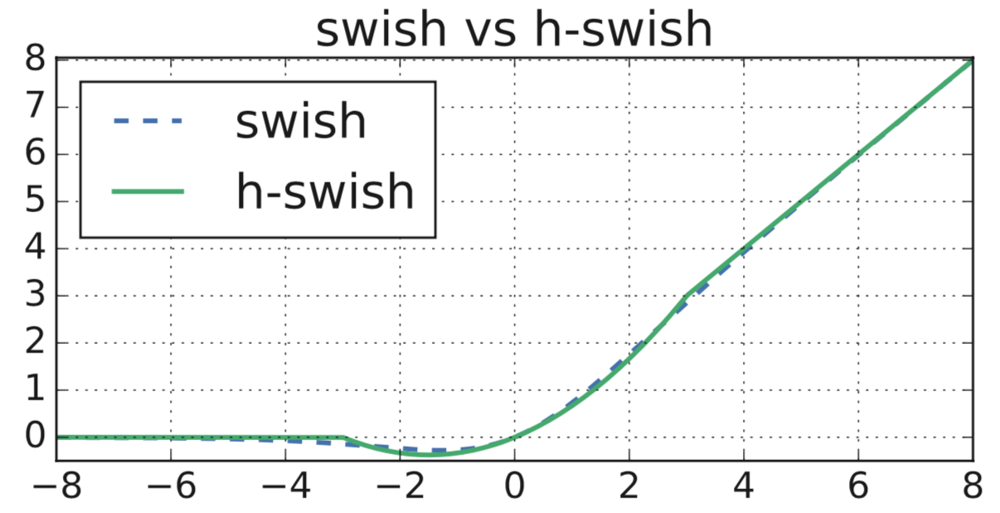

% From Dumbphone to Smartphone: How to run Computer Vision on anything
% Jordi Olivares
% April 6, 2020

## The problem

Want: Run Computer Vision on toaster phone

Problem: Toaster phone has toast CPU

Solution: Make algorithm run on toast

## What is this talk about

This talk is about the techniques used in the Computer Vision world in order to make their networks perform better and faster.

We won't be talking about actual Neural Net architectures, but about the blocks and knowledge inside of them. We will focus on the Mobilenet family.

# MobileNet V1

## The core teaching

* We can factor convolution into applying a filter and combining the features
* We will call this Depthwise Separable Convolution

## Depthwise Separable Convolution

* A 2D filter of size $D_K$ is applied to each channel separately ($M$ channels) on an image of size $D_F$
* The resulting feature map is convolved with $N$ 1x1 convolutions

## An image is better than words

## Reduction in operations (w.r.t. normal Convolution)

## Empirically it works almost the same

| Neural Net    | Accuracy | Million MAdds | Million Parameters |
| ------------- | -------- | ------------- | ------------------ |
| MobileNet-224 | 70.6%    | 569           | 4.2                |
| GoogleNet     | 69.8%    | 1550          | 6.8                |
| VGG-16        | 71.5%    | 15300         | 138                |

# MobileNet V2

* Builds upon the Depthwise Separable Convolution
* Ingest new concepts such as Residual Networks (Resnet) and bottleneck layers
* Puts a new spin on them by creating the Inverted Residual Bottleneck layer

## Let's talk about information loss

## What's an Inverted Bottleneck layer?

## What's an **Inverted** Residual Bottleneck layer?

## Give me the data, I don't care about your theoretics

## Performance-wise, it's cool

# MobileNet v3

* We use a new activation function! (h-swish)
* We add a new block layer! (Squeeze-and-Excite)
* We let the machine search for the architecture! (**Won't talk about it here**)

## Squeeze-and-Excite

## Specific implementation in a ResNet

## In the Mobilenet V3

## Swish

## Swish vs Other activation functions

# h-swish

## Not that different between them

# Conclusion

These small changes can lead to drastic reduction in inference time at minimal cost of performance.

I recommend starting with MobileNet V3 as you'll see reduced costs in computation (you can use a smaller instance) and it opens more use cases.