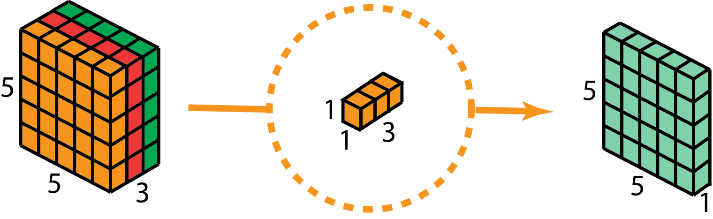

% From Dumbphone to Smartphone: How to run Computer Vision on anything
% Jordi Olivares
% March 12, 2020

# What is this talk about

## The problem

We want to run AI

# Mobilenet V1

## The core teaching

* We can factor convolution into applying a filter and combining the features
* We will call this Depthwise Separable Convolution

## Depthwise Separable Convolution

* A 2D filter is applied to each channel separately
* The resulting feature map is convolved with a 1x1 convolution

### An image is better

### Reduction in operations (w.r.t. normal Convolution)

### Empirically it works almost the same

| Neural Net    | Accuracy | Million MAdds | Million Parameters |
| ------------- | -------- | ------------- | ------------------ |
| MobileNet-224 | 70.6%    | 569           | 4.2                |
| GoogleNet     | 69.8%    | 1550          | 6.8                |
| VGG-16        | 71.5%    | 15300         | 138                |

# Mobilenet V2

